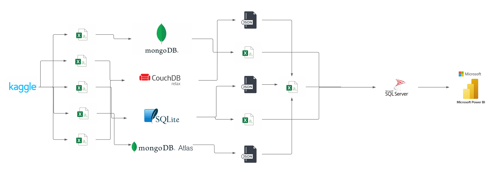

# Proyecto_Final_AD2025

---

## Contenido

---

### 1. Tráfico e Informática  
Contiene datos recopilados sobre accidentes de tráfico a nivel global. Se incluyen los scripts para la transferencia de datos y las visualizaciones respectivas.  
🔗 [Dataset: Global Road Accidents](https://www.kaggle.com/datasets/ankushpanday1/global-road-accidents-dataset)  

### 2. Arte y Proyectos en Kickstarter  
Análisis de proyectos de Kickstarter en diferentes categorías, con datos sobre su éxito y financiamiento. Se incluyen los scripts de procesamiento y visualización.  
🔗 [Dataset: Kickstarter Projects](https://www.kaggle.com/datasets/kemical/kickstarter-projects)  

### 3. Ciberseguridad y Noticias Mundiales  
Contiene información actualizada sobre ataques de ciberseguridad, recopilada de diversas fuentes. Se presentan visualizaciones y análisis.  
🔗 [Dataset: Cybersecurity Attacks](https://www.kaggle.com/search?q=updated+cybersecurity+attacks)  

### 4. Deportes y Fútbol  
Análisis de datos de jugadores de fútbol, con información sobre sus atributos y desempeño. Incluye scripts para análisis y visualización.  
🔗 [Dataset: FIFA Players](https://www.kaggle.com/datasets/joebeachcapital/fifa-players?select=male_teams_23.csv)  

### 5. Noticias y Desastres Naturales (Incendios)  
Dataset sobre incendios en California, con datos históricos y visualizaciones sobre su impacto.  
🔗 [Dataset: California Wildfire Data](https://www.kaggle.com/datasets/vijayveersingh/the-california-wildfire-data)  

---

## 📂 [Documentación](./Documentacion)  
Contiene:  
✅ Cronograma de actividades del proyecto  
✅ Diapositivas que se presentarán en el proyecto  
✅ Informe del proyecto  

---

## 📂 [Proyecto Final](./PROYECTO%20FINAL)  
Enlace a OneDrive con los datasets debido a restricciones de tamaño en GitHub.  

---

## Videos Explicativos

🎥 **Explicación del proceso de recopilación de datos**  
📌 [Ver video en YouTube](https://youtu.be/0-wUmSFA1o0)  

🎥 **Explicación de las conclusiones de los dashboards**  
📌 [Ver video en YouTube](https://youtu.be/yht2iffxpoI)  

---

## Arquitectura

